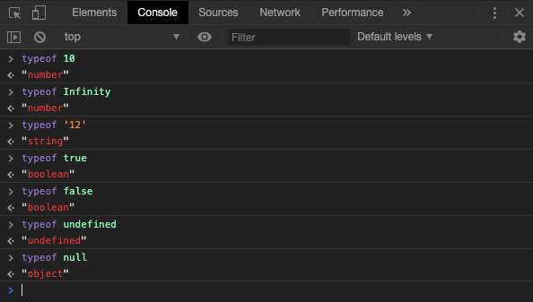

## Ejemplo 1: Tipos de datos y operador `typeof`

### Objetivo

Usaremos el operador `typeof` para conocer los distintos tipos de datos de manera práctica.

#### Requisitos

Puedes hacer el siguiente ejemplo directo en la consola de Chrome.

#### Desarrollo

```javascript
// Numbers
typeof 10;	// "number"
typeof 12.5;	// "number"
typeof 2.5e+6;	// "number"
typeof Infinity;	// "number"
typeof NaN;	// "number"

// Strings
typeof ' ';	// "string" - Espacios en blanco cuentan como caracteres
typeof 'Hello World';	// "string"
typeof '12';	// "string" - Números dentro de comillas son strings

// Booleans
typeof true;	// "boolean"
typeof false;	// "boolean"

// Undefined
typeof undefined;	// "undefined"

var name;
typeof name; // "undefined" - Aún no se asigna un valor

// Null
typeof Null;	// "object"
```
> Cuando usamos el operador `typeof` con `null` obtenemos como resultado `object` en lugar de `null`.
Esto es considerado como un bug en JavaScript que está presente desde su creación, debido a que hay muchísimo código escrito tomando en cuenta este comportamiento, la idea de corregir este bug fue abandonada ya que causaría más problemas.


