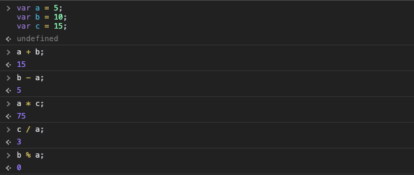
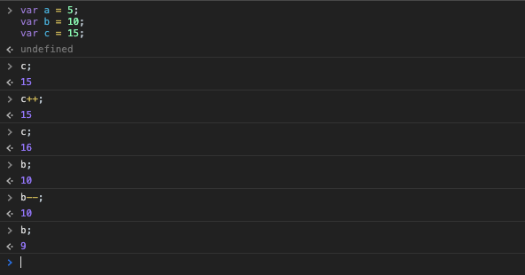

## Ejemplo 2: Operadores

### Objetivo

Practicar los distintos operadores básicos que proporciona JavaScript.

#### Requisitos

Puedes hacer el siguiente ejemplo directo en la consola de Chrome.

#### Desarrollo

```javascript
var a = 5;
var b = 10;
var c = 15;

a + b;  // 15

b - a;  // 5

a * c;  // 75

c / a;  // 3

b % a;  // 0
```



Este tipo de operaciones no cambia el valor de las variables `a`, `b` y `c` ya que no estamos usando el operador de asignación `=`. Sin embargo, los operadores de incremento y decremento sí cambian el valor de las variables.

```javascript
var a = 5;
var b = 10;
var c = 15;

c++;  // 16

b--;  // 9
```



> Es bueno aclarar sobre la separación de cada línea en JavaScript con punto y coma `;`. JavaScript no requiere estrictamente usar puntos y comas al final de cada línea, sin embargo vale la pena colocarlos. Ahora, en algún punto, cuando alcances un mejor nivel, podrías considerarlos opcional mientras cumplas con ciertos criterios. [Te compartimos un artículo que habla sobre este tema.](https://flaviocopes.com/javascript-automatic-semicolon-insertion/)
