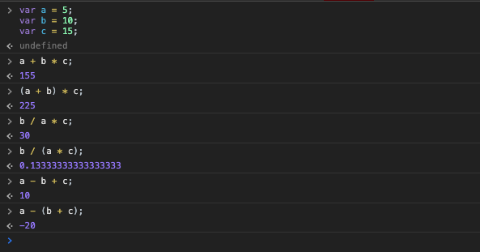

[`Programación con JavaScript`](../../Readme.md) > [`Sesión 01`](../Readme.md) > `Ejemplo 03`

---

## Ejemplo 2: Precedencia de operadores

### Objetivo

Practicar el orden de precedencia de los operadores en JavaScript.

#### Requisitos

Puedes hacer el siguiente ejemplo directo en la consola de Chrome.

#### Desarrollo

```javascript
var a = 5;
var b = 10;
var c = 15;

a + b * c;  // 155

(a + b) * c;  // 255

b / a * c;  // 30

b / (a * c);  // 0.1333

a - b + c;  // 10

a - (b + c);  // -20
```

Cuando hay distintos operadores con el mismo orden de precedencia se sigue el orden de asociatividad, que puede ir de izquierda a derecha o derecha a izquierda dependiendo del tipo de operador. El uso de paréntesis nos permite controlar el orden de precedencia agrupando las operaciones que queremos que se realicen primero.


