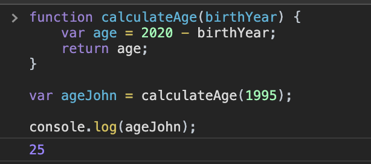
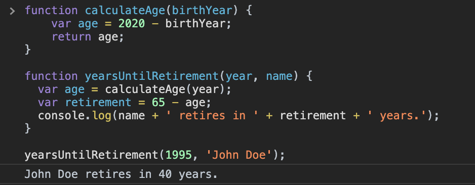

[`Programación con JavaScript`](../../Readme.md) > [`Sesión 03`](../Readme.md) > `Ejemplo 01`

---

## Ejemplo 1: Funciones

### Objetivo

Conocer la sintaxis y cómo usar funciones en JavaScript.

#### Requisitos

En una nueva carpeta vamos a crear un archivo `HTML` en blanco llamado `index.html`:

```html
<html>
  <head>
    <script type="text/javascript" src="./ejemplos-sesion-3.js"></script>
  </head>
</html>
```

Dentro de la misma carpeta creamos un archivo `ejemplos-sesion-3.js` que es donde se trabajarán los ejemplos de esta sesión. Finalmente abre el archivo `index.html` en Chrome e inspecciona la consola para ver los resultados.


#### Desarrollo

Vamos a dar calcular la edad mediante una función que reciba el año de nacimiento.

```javascript
function calculateAge(birthYear) {
    var age = 2020 - birthYear;
    return age;
}
```

Cuando vemos `return` en una función significa que va a retornar un valor al final de la ejecución de la función. Este valor puede ser guardado en una variable.

```javascript
var ageJohn = calculateAge(1995);
```

Para ejecutar una función colocamos el nombre de la función seguido de `()` con los argumentos necesarios. En este ejemplo la variable `ageJohn` contiene el resultado que retorne `calculateAge()`.

```javascript
function calculateAge(birthYear) {
    var age = 2020 - birthYear;
    return age;
}

var ageJohn = calculateAge(1995);

console.log(ageJohn); // 25
```



Ahora podemos llamar la misma función las veces que queramos sin necesidad de repetir las mismas líneas de código una y otra vez. Las funciones también pueden llamar a otras funciones.

```javascript
function yearsUntilRetirement(year, name) {
  var age = calculateAge(year);
  var retirement = 65 - age;
  console.log(name + ' retires in ' + retirement + ' years.');
}
```

Algunas funciones no retornan valor alguno, como `yearsUntilRetirement` qué sólo muestra un mensaje en consola. En este caso no podemos guardar el resultado en una variable como hicimos con `ageJohn`.

```javascript
yearsUntilRetirement(1995, 'John Doe');
// John Doe retires in 40 years.
```


