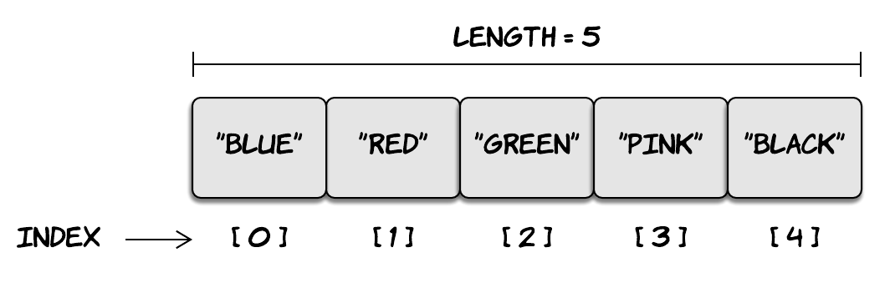

[`Programación con JavaScript`](../Readme.md) > `Sesión 04`

# Sesión 4: Objetos y Arreglos

## Objetivos

Conocer los objetos y sus principales características, así como las diferencias
con otros tipos de datos

---

## Tabla de Contenidos

- **[Arreglos](#arreglos)**

	- [Ejemplo 1: Arreglos](./Ejemplo-01)

	- [Reto 1: Calcular promedio](./Reto-01)

---

## Arreglos

Ya hemos trabajado con distintos tipos de datos como string, number y boolean. Muchas veces necesitamos representar una colección de variables, en lugar de crear múltples variables podemos utilizar arreglos.

```javascript
var color1 = 'Red';
var color2 = 'Blue';
var color3 = 'Green';

console.log(color1);	// Red
console.log(color2);	// Blue
console.log(color3);	// Green
```

En lugar de crear tres variables distintas podemos crear un arreglo usando corchetes `[]` y separando cada elemento del arreglo con comas.

```javascript
var colors = ['Red', 'Blue', 'Green'];

console.log(colors);	// ['Red', 'Blue', 'Green']
```

Todo elemento de un arreglo tiene un identificador numérico que representa su posición en el arreglo. A esto se le conoce como `index` y se empieza a contar desde cero.



Este `index` nos permite acceder a un elemento específico del arreglo.

```javascript
var colors = ['Red', 'Blue', 'Green'];

console.log(colors[0]);	// 'Red'
console.log(colors[1]);	// 'Blue'
console.log(colors[2]);	// 'Green'
console.log(colors[3]);	// undefined
```

También se pueden manipular los elementos de un arreglo con el `index`.

```javascript
var colors = ['Red', 'Blue', 'Green'];

console.log(colors);	// ['Red', 'Blue', 'Green']

colors[1] = 'Pink';

console.log(colors);	// ['Red', 'Pink', 'Green']
```

Para obtener la longitud del arreglo (cantidad de elementos) utilizamos el método `length`.

```javascript
var colors = ['Red', 'Blue', 'Green'];

console.log(colors);	// ['Red', 'Blue', 'Green']

console.log(colors.length);	// 3
```

#### [Ejemplo 1: Arreglos](./Ejemplo-01)

#### [Reto 1: Calcular promedio](./Reto-01)

---
