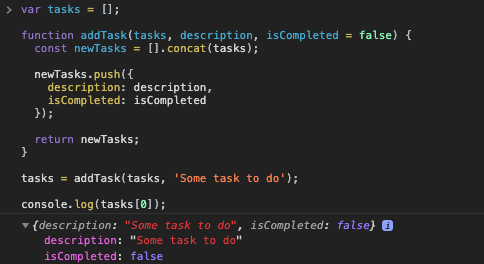

[`Programación con JavaScript`](../../Readme.md) > [`Sesión 06`](../Readme.md) > `Reto Final`

---

## Reto Final

### Objetivo

Integrar principios de programación funcional en el proyecto.

#### Desarrollo

En la sesión anterior creamos un constructor para crear nuevas instancias de `Task` e ir agregando tareas a nuestro arreglo `tasks` mediante la función `addTask()`:

```javascript
var tasks = [];

var Task = function(description, isCompleted) {
  this.description = description;
  this.isCompleted = isCompleted;
}

function addTask(description, isCompleted = false) {
  tasks.push(new Task(description, isCompleted));
}
```

La función `addTask()` no es una función pura porque está modificando `tasks`, una variable que no forma parte de los parámetros de la función.

```javascript
function addTask(tasks, description, isCompleted = false) {
  tasks.push(new Task(description, isCompleted));
}
```

Agregar `tasks` a la lista de parámetros no es suficiente, la función sigue sin ser pura porque se encuentra mutando `tasks`. Debemos crear una copia de `tasks` para no mutar el arreglo original.

```javascript
function addTask(tasks, description, isCompleted = false) {
  var newTasks = tasks.map(function(task) { return task; });

  ...
}
```

En el [ejemplo 2](../Ejemplo-02/Readme.md) vimos cómo usar `map()` para crear una copia de un arreglo. En uno de los retos implementamos el método `concat()` para unir dos arreglos, este método es una buena alternativa para `map()`.

```javascript
function addTask(tasks, description, isCompleted = false) {
  const newTasks = [].concat(tasks);

  ...
}
```

Por último debemos agregar la nueva tarea a `newTasks`. En este caso no usaremos el constructor `Tasks`, simplemente agregaremos un objeto nuevo a `newTasks`.

```javascript
function addTask(tasks, description, isCompleted = false) {
  const newTasks = [].concat(tasks);

  newTasks.push({
    description: description,
    isCompleted: isCompleted
  });

  return newTasks;
}
```

Para usar esta función debemos siempre pasar `tasks` y reemplazarlo con el nuevo arreglo creado en `addTask()`.

```javascript
var tasks = [];

function addTask(tasks, description, isCompleted = false) {
  const newTasks = [].concat(tasks);

  newTasks.push({
    description: description,
    isCompleted: isCompleted
  });

  return newTasks;
}

tasks = addTask(tasks, 'Some task to do');

console.log(tasks[0]);  // { description: 'Some...', isCompleted: false }
```


