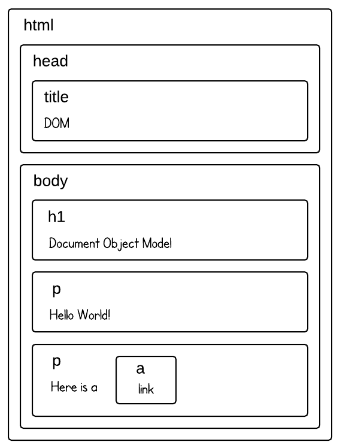

[`Programación con JavaScript`](../Readme.md) > `Sesión 07`

# Sesión 7: Introducción al DOM

## Objetivos

Identificar el rol de JavaScript en el desarrollo web al permitir interactividad entre el usuario y la página web.

---

## Tabla de Contenidos

- **[DOM](#dom)**

	- [Ejemplo 1: Inspeccionando el DOM](./Ejemplo-01)

- **[Estructura de datos de árbol](#estructura-de-datos-de-árbol)**

- **[Reto final](./Reto-final)**

- **[Postwork](./Postwork)**

---

## ¿Qué es el DOM?

Cuando abres una página web el navegador obtiene el código HTML y lo analiza para construir un modelo de la estructura del documento, este modelo le permite al navegador mostrar la página en la pantalla.

A esto se le conoce como DOM (Document Object Model), una representación del documento que se muestra en el navegador. Esta estructura puede ser leída y modificada en tiempo real, es decir, cualquier cambio que se haga a este modelo será reflejada en la pantalla en el momento.

Un documento HTML es como una serie de cajas anidadas. Las etiquetas como `<body> </body>` encierran otras etiquetas, y estas a su vez envuelven otras etiquetas o texto. Tomemos como ejemplo el siguiente documento HTML:

```html
<!doctype html>
<html>
  <head>
    <title>DOM</title>
  </head>
  <body>
    <h1>Document Object Model</h1>
    <p>Hello World!</p>
    <p>Here is a
      <a href="#">link</a>
    </p>
  </body>
</html>
```

Esta es la estructura de esa página:



Para cada una de estas cajas existe un objeto en JavaScript con el que podemos interactuar para saber qué etiqueta HTML representa y qué otras cajas o texto contiene. La variable global `document` nos da acceso a todos estos objetos.

> `document` es una variable global, es decir, se puede acceder a ella desde cualquier parte del script o código. Todas las funciones que hagas pueden hacer referencia a esta variable.

#### [Ejemplo 1: Inspeccionando el DOM](./Ejemplo-01)

---

## Estructura de datos de árbol

Esta estructura de datos imita la estructura jerárquica de un árbol. Es una colección de nodos con un único nodo padre o raíz. Es muy útil para mantener una colección de datos ordenada, ya que es más fácil seleccionar o insertar elementos en un árbol que en un arreglo plano.

El DOM es una estructura de datos de árbol, y es común nombrarlo también un árbol de nodos. Cada nodo representa una etiqueta de HTML, siendo `document.documentElement` la raíz del árbol, el cuál representa la etiqueta `html`. Cada nodo puede tener nodos hijos (children) o ser un nodo hoja (último elemento de la rama) como el texto dentro de una etiqueta `p`.

Esta es otra forma de visualizar el ejemplo que vimos anteriormente:


`html` es el nodo raíz del árbol. Los nodos hojas son los últimos nodos de la rama, los elementos de texto. Las flechas indican una relación padre-hijo entre nodos.

Los nodos del DOM contienen vínculos entre ellos como los que se muestran en el siguiente diagrama:


Todos los nodos tienen una propiedad `parentNode` que apunta al nodo que lo contiene. La propiedad `childNodes` apunta a un objeto parecido a un arreglo que contiene los hijos del nodo. Las propiedades `firstChild` y `lastChild` apuntan al primer y último nodo hijo respectivamente o `null` si no tienen. De igual forma, `previousSibling` y `nextSibling` apuntan a los nodos hermanos, es decir, los nodos adyacentes que comparten el mismo padre.
